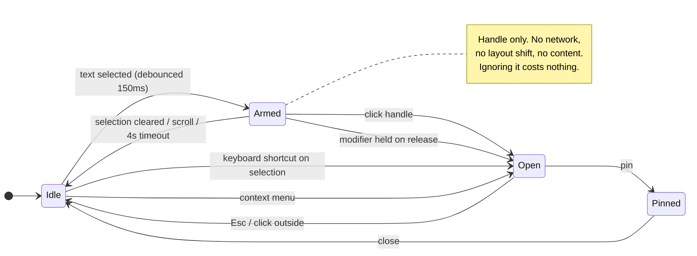
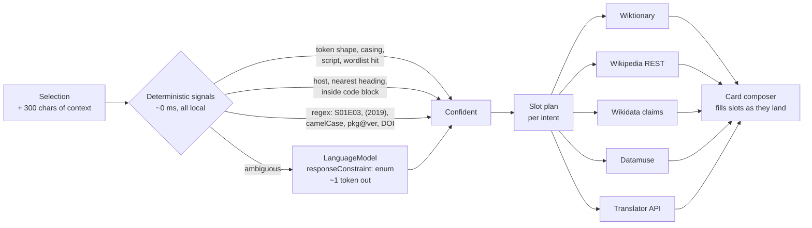

> [!TLDR]
> The category has split into tools that are **fast but shallow** and tools that are **deep but slow**. The fast-and-deep quadrant is empty, and two things that landed since this project started make it reachable: Chrome ships a free on-device model to extensions (Prompt API, Chrome 138), and Wikipedia's REST summary answers in 348 ms from a hot CDN edge.
>
> - **The bet:** route by intent, answer with *evidence*, use the local model as a classifier and composer — never as the source of facts. That is the one thing Gemini-in-Chrome structurally cannot do well on names, dates and numbers.
> - **The trigger decides everything.** Auto-popup on `mouseup` — the current spec's default — is the single behaviour every reviewer in this category complains about. A two-tier handle costs nothing to ignore.
> - **Two things are broken right now:** `api.dictionaryapi.dev` returned HTTP 502 on 6 of 6 probes today, and the build calls Wikimedia without the `Api-User-Agent` header their etiquette policy requires.
> - **Turkish finding:** Chrome's Translator API supports `tr`; the Prompt API does not. On-device Turkish *translation* yes, on-device Turkish *reasoning* no.

## Scope and how this was checked {#scope}

This report covers three things you asked for, in order: what exists, where the gap is, and what to build. It is meant to be read start to finish — the competitor matrix and the API appendix are the only parts designed for lookup.

Evidence is marked throughout, because the tiers do not carry the same weight:

| Tier | What it means here | What it may settle |
|---|---|---|
| **Measured** | Executed from this machine on 2026-08-11 — API latency, HTTP status, cache headers, and the current source tree | Anything, including a negative such as "this endpoint is down" |
| **Read** | Read in the vendor's own documentation, with version numbers quoted from it — Chrome's built-in-AI availability, API rate limits, store review policy | A mechanism or a stated intent, not an observed behaviour |
| **Estimated** | My judgement from observed product behaviour — every competitor response time in the quadrant below | Relative position only. Never a number to plan against |

The distinction matters most at the quadrant chart, where measured and estimated points sit on the same axes. The one measured point there is the target position, and it is measured because it is the only one that has to be true.

## Where the ground moved {#ground-moved}

You started this when a selection-lookup extension meant "call a dictionary API and draw a box". Four numbers changed the shape of the problem.

```oku-kpi-grid
{"tiles":[
  {"num":"138","label":"Chrome version where the Prompt API went stable for extensions — a free, local model with no key"},
  {"num":"Jan 2026","label":"Chrome ships its own select-text → \"Send to Gemini\" button. The incumbent is now pre-installed."},
  {"num":"348 ms","label":"Measured Wikipedia REST summary, edge-cached 14 days. Structured facts are now fast enough to beat an LLM."},
  {"num":"22 GB","label":"Free disk the on-device model requires. The local path cannot be the only path."}
]}
```

Two of those are opportunities and two are constraints, and they interact. Chrome giving every extension a local language model for free is what makes a smart lookup tool possible without an account or a bill. Chrome shipping its own selection→Gemini flow is what makes a *general chat* answer worthless as a differentiator — that box is already in the browser, and it will always be one keystroke closer than yours.

What is left is the thing Gemini-in-Chrome is bad at: a **structured, sourced, sub-second card** for a specific kind of question. That is the opening.

### The category in two dimensions {#category-quadrant}

```oku-chart
{"type":"quadrant",
 "title":"Selection-lookup tools — time to first answer vs. depth of that answer",
 "x_label":"Seconds until something useful is on screen",
 "y_label":"Depth (0 = opens a tab, 5 = synthesised + sourced)",
 "quadrants":{"x":1.0,"y":2.6,"labels":["Fast and deep — empty","Deep but slow","Routes you away","Slow and shallow"]},
 "series":[
  {"label":"Single-purpose, in place","color":"accent","data":[
    {"x":0.05,"y":2.0,"label":"Yomitan (offline)"},
    {"x":0.35,"y":1.5,"label":"Google Dictionary"},
    {"x":0.40,"y":1.5,"label":"QuickDef / Instant Dictionary"},
    {"x":0.20,"y":2.0,"label":"macOS Look Up"},
    {"x":0.90,"y":2.0,"label":"Immersive Translate"}]},
  {"label":"Dispatchers — never answer","color":"muted","data":[
    {"x":0.05,"y":0.3,"label":"PopClip"},
    {"x":0.08,"y":0.3,"label":"Swift Selection Search"}]},
  {"label":"AI sidebars & Gemini in Chrome","color":"warn","data":[
    {"x":2.5,"y":4.2,"label":"Gemini in Chrome"},
    {"x":3.0,"y":4.0,"label":"Sider / Monica / Merlin"},
    {"x":4.0,"y":4.5,"label":"Wiseone / Scholarcy"}]},
  {"label":"Where Quick Lookup should land","color":"success","data":[
    {"x":0.40,"y":4.0,"label":"Quick Lookup (target)"}]}
 ]}
```

*Depth rubric: 0 = opens another tab and answers nothing; 1 = one field; 2 = several fields of one kind; 3 = multiple kinds of information; 4 = multiple kinds plus synthesis; 5 = plus citations you can check. X positions are order-of-magnitude estimates from observed product behaviour, not measurements — except that the 400 ms target for Quick Lookup is grounded in the measured 348 ms Wikipedia response in the appendix.*

The top-left quadrant is not empty because nobody wants it. It is empty because the two camps got there from opposite directions and neither can cross: the dictionary camp has no mechanism for anything that is not a headword, and the AI camp pays a network round trip to a large model for every answer, which puts a floor of roughly two seconds under everything it does.

## Who you are competing with {#competitors}

Five camps. Each solves one piece well and that piece is worth taking.

```oku-table
{"headers":[
  "Product",
  {"label":"Camp","filter":"chips","values":["Dictionary","Scanning dictionary","Dispatcher","AI sidebar","Browser-native"]},
  "Trigger",
  {"label":"Answers in place?","status":{"Yes":"good","Partly":"warn","No":"bad"}},
  "Cost / friction",
  "What is worth taking"],
 "rows":[
  ["Google Dictionary (by Google) — 2M users, 4.36★ / 13,720",{"value":"Dictionary","values":["Dictionary"]},"Double-click word","Yes","Free, no account","Double-click is the lowest-friction gesture in the category. Reviews still cite \"No definition found\" and no PDF support."],
  ["Yomitan — 100k+ learners",{"value":"Scanning dictionary","values":["Scanning dictionary"]},"Hold Shift + hover","Yes","Free; heavy first-run dictionary import","The best-solved trigger anywhere: nothing fires unless you ask. Fully offline. Anki export turns a lookup into retention."],
  ["QuickDef / Instant Dictionary / Dictionariez",{"value":"Dictionary","values":["Dictionary"]},"Double-click or select","Yes","Free","CEFR-calibrated plain-language definitions — reading level as a first-class output, not an afterthought."],
  ["PopClip (macOS) — ~200 extension directory",{"value":"Dispatcher","values":["Dispatcher"]},"Select text → action bar","No","Paid, one-off","The action-bar affordance: a neutral strip appears, costs nothing to ignore, and never claims screen space for content you did not ask for."],
  ["Swift Selection Search",{"value":"Dispatcher","values":["Dispatcher"]},"Select text → engine icons","No","Free; development on indefinite break","User-defined engine templates. Your \"quick links\" row is the same idea and should stay."],
  ["Immersive Translate — 3M CWS users, 3.93★",{"value":"Dictionary","values":["Dictionary"]},"Selection or full page","Partly","Mandatory sign-in, daily quotas, paywalled keys","A cautionary tale, not a pattern. The rating fell after sign-in and quotas landed together. Do not build a daily tool that can log you out."],
  ["Sider / Monica / Merlin / MaxAI / HARPA",{"value":"AI sidebar","values":["AI sidebar"]},"Selection button or sidebar","Partly","Account + quota; some BYO-key","Selection-scoped quick actions (summarise / rewrite / explain) as one-click verbs rather than a chat box."],
  ["Wiseone / Glasp / Scholarcy",{"value":"AI sidebar","values":["AI sidebar"]},"Sidebar on article","Partly","Account; free tier","Cross-checking against other sources, shown inline. The closest anyone gets to \"sourced\", and it is still a sidebar you must go to."],
  ["Gemini in Chrome — side panel, Jan 2026",{"value":"Browser-native","values":["Browser-native"]},"Select → \"Send to Gemini\"","Partly","Free, pre-installed","This is the competitor. Free-form chat, tab-specific panel, cloud latency, no structured entity card."],
  ["macOS Look Up / Raycast Quick AI",{"value":"Browser-native","values":["Browser-native"]},"Three-finger tap / ⌘⇧Tab","Yes","OS-level","They set the latency expectation you are judged against. Nothing browser-based feels acceptable if it is slower than a three-finger tap."]
 ]}
```

The pattern across the table: **the tools that answer in place cannot handle anything but a headword, and the tools that handle anything cannot answer in place.** Wiseone is the only one attempting sourced answers, and it does it in a sidebar, which means going somewhere.

## Why none of them is your daily driver {#three-jobs}

You named three jobs. They look like one job — "tell me about this selection" — and they are not, because a good answer has a different *shape* for each.

```oku-compare-grid
{"cards":[
 {"t":"An English word","b":"**A good answer contains:** the sense that fits *this* sentence first, IPA plus audio, register (formal / dated / technical), 2–3 numbered senses, common collocations, and — for you specifically — a one-line Turkish gloss.\n\n**Served today by:** the dictionary camp, partly. They give you every sense in dictionary order and leave you to find the right one. None of them read the surrounding sentence.","verdict":"warn"},
 {"t":"A technical term","b":"**A good answer contains:** what it is in one line, which ecosystem it belongs to, how it relates to the thing you already know, and one canonical link — MDN, the project's own docs, the spec.\n\n**Served today by:** effectively nobody. Dictionaries return nothing for `MERGE INTO` or `hidden partitioning`. AI sidebars answer, slowly, and cannot be checked.","verdict":"bad"},
 {"t":"A person or named entity","b":"**A good answer contains:** an image, one line of who-and-why-known, dates, role, and the single thing they are known for.\n\n**Served today by:** Wikipedia hovercards, if you happen to be on a Wikipedia link. Not from arbitrary page text. AI sidebars answer but this is exactly where a language model invents dates and affiliations.","verdict":"bad"}
]}
```

Three jobs, three answer shapes, one gesture. That is the product. It also explains why the AI-sidebar camp cannot simply win by being smarter: for job three, a fluent wrong answer is worse than no answer, and a language model asked "who is X" with no retrieval is a fluent-wrong-answer machine.

> [!IMPORTANT]
> The differentiating decision follows directly: **facts come from Wikidata, Wikipedia and Wiktionary; the local model only classifies the input and phrases the one-line summary.** That inverts the AI-sidebar architecture, and it is what makes the answer both faster and checkable.

## The trigger decides whether you use it daily {#trigger}

Every other decision in this document is recoverable. This one is not: a lookup tool that fires when you did not ask gets uninstalled in a week, and the current `SPEC.md` specifies exactly that behaviour as the default — *"Auto-open popup on text selection mouseup (no keyboard shortcut)"*.

The category's own review record is unambiguous about the cost. Reviewers describe competing extensions as annoying precisely because the definition pops up every time text is selected by click-and-drag or double-click — which is most of the time, since selecting text is also how people read, copy and scroll.

Yomitan solved this and the solution is worth copying exactly: **nothing happens unless a modifier is held.** PopClip solved it differently: something always appears, but it is an *affordance*, not content — a neutral strip that costs nothing to ignore because it never covers what you were reading.



The state that does the work is `Armed`. It is the whole difference between "this tool is always there" and "this tool is always in the way": something appeared, it told you help is available, and it consumed nothing — no request, no reflow, no covered text.

```oku-compare-grid
{"cards":[
 {"t":"Auto-open on mouseup — current spec default","b":"Fires on every selection, including the selections people make while reading or copying. Costs a network round trip and covers the text that prompted it.\n\nThis is the behaviour the category is criticised for.","verdict":"bad"},
 {"t":"Double-click only — Google Dictionary","b":"Low friction and well understood. But it only ever addresses one word, which rules out job two and job three: `hidden partitioning` and `Grace Hopper` are not double-clickable.","verdict":"warn"},
 {"t":"Modifier + hover — Yomitan","b":"Zero false positives and no UI at all until asked. Excellent for scanning dense text. Requires a hand on the keyboard, so it is a second mode rather than the primary one.","verdict":"good"},
 {"t":"Two-tier handle — recommended","b":"Tier 0: a small handle appears at the end of the selection. No request, no content, no reflow. Tier 1: click it, hold the modifier on release, or press the shortcut — then the card opens.\n\nAdds Yomitan's discipline to PopClip's discoverability, and keeps a keyboard-only path for when your hands are already there.","verdict":"good"}
]}
```

Three rules make the difference between a handle and a nuisance, and all three are cheap: it renders inside a shadow root with `contain: layout paint` so it can never move the page; it never appears inside an editable field unless explicitly enabled; and a per-site kill switch is reachable in one click from the card itself, not buried in options.

## What you can build on now {#builtin-ai}

Chrome's built-in AI is the reason to redesign rather than patch. It is free, local, keyless, and — for extensions — it has been stable longer than for web pages. All of the following is read from Chrome's own documentation.

| API | Extensions | Notes that matter here |
|---|---|---|
| Prompt API (`LanguageModel`) | **Chrome 138** (web only reached 148) | JSON Schema output via `responseConstraint`. Text, image and audio input. |
| Summarizer API | Chrome 138 stable | `key-points` / `tldr` / `teaser` / `headline`, with a `speed` vs `capability` preference. |
| Translator API | Desktop only, no mobile | 39 languages **including `tr`**, downloaded as per-pair language packs. |
| Language Detector API | Desktop only, no mobile | Small model, often already present because other Chrome features use it. |
| Writer / Rewriter / Proofreader | Same foundation model | Not needed for this product. |

Four constraints come with it, and each one forces a design decision rather than merely being noted.

- **Hardware gate.** 22 GB free on the profile volume, plus either a GPU with more than 4 GB VRAM or a CPU with 16 GB RAM and 4 cores. Windows 10/11, macOS 13+, Linux, or ChromeOS on Chromebook Plus. Android and iOS are out. *Consequence: the extension must be genuinely useful with the model unavailable.*
- **Language gate.** The Prompt API accepts `en`, `ja`, `es`, `de`, `fr`. Turkish is not among them. The Translator API does support `tr`. *Consequence: on-device Turkish glosses yes; on-device Turkish reasoning no.*
- **Download gate.** The model downloads on first use and reports `downloadable` / `downloading` / `available`. It needs an unmetered connection. *Consequence: first-run has three states to design, not one.*
- **Context gate.** Sessions have a finite context window with a `contextoverflow` event and a `QuotaExceededError`. *Consequence: page context passed to the classifier must be bounded — a few hundred characters, not the article.*

```oku-compare-grid
{"cards":[
 {"t":"Tier 1 — On-device (default)","b":"`LanguageModel` + `Translator` + `LanguageDetector`, no key, no account, no network for inference. Used for: intent classification when the cheap signals are ambiguous, and one-line phrasing of an answer already retrieved from a data source.\n\nNever used to state a fact.","verdict":"good"},
 {"t":"Tier 2 — No model at all","b":"When the device fails the hardware gate. The deterministic intent router still runs, and every evidence provider still works. You lose the ambiguous-case classification and the composed one-liner; you keep the dictionary, the entity card and the links.\n\nThis tier must be shipped and tested, not treated as a degraded mode.","verdict":"neutral"},
 {"t":"Tier 3 — Bring your own key (opt-in)","b":"The existing OpenAI / Groq / OpenRouter / Cloudflare path, kept for the two cases the local model cannot serve: Turkish reasoning, and deliberate deep-dive on request.\n\nOff by default. Keys in `storage.local`, never `storage.sync`.","verdict":"warn"}
]}
```

## What is broken in the current build {#current-state}

The existing tree is 1,427 lines across 21 files — a working MV3 skeleton with a provider registry, cache, planner, and a Shadow-DOM popup. The architecture is sound and most of it survives the redesign. Five specific things do not.

```oku-chart
{"type":"bar",
 "title":"Measured response time from this machine, 2026-08-11 (single sample per endpoint)",
 "orientation":"horizontal",
 "x_label":"milliseconds",
 "rows":[
  {"label":"Wikipedia REST summary","value":348,"color":"success"},
  {"label":"Wikipedia REST title search","value":442,"color":"success"},
  {"label":"Datamuse related words","value":446,"color":"success"},
  {"label":"Stack Exchange search","value":501,"color":"accent"},
  {"label":"Wikidata wbsearchentities","value":523,"color":"warn"},
  {"label":"HN Algolia search","value":950,"color":"accent"},
  {"label":"freedictionaryapi.com","value":956,"color":"accent"},
  {"label":"Crossref works","value":1023,"color":"warn"},
  {"label":"Open Library search","value":1371,"color":"warn"},
  {"label":"OpenAlex works","value":2542,"color":"danger"}
 ]}
```

> [!CAUTION]
> **`api.dictionaryapi.dev` is down.** It returned HTTP 502 on 6 consecutive probes with ~290 ms latency each — a fast failure, i.e. an infrastructure error rather than a timeout. This is the dictionary provider the current build depends on, so the dictionary path is dead today. `freedictionaryapi.com` is a working replacement: Wiktionary-backed, 1,000 requests/hour/IP, no key, CC BY-SA 4.0.

The other four findings, in the order I would fix them:

| Finding | Evidence | Why it matters |
|---|---|---|
| No `Api-User-Agent` header on Wikimedia calls | `wikipedia.ts` and `wikidata.ts` issue a bare `fetch` | Wikimedia's etiquette policy requires a meaningful User-Agent. Browser JS cannot set `User-Agent`, so `Api-User-Agent` is the documented workaround. Without it you are anonymous traffic subject to being throttled first. |
| Wikidata is on the hot path but is never cached | Measured `cache-control: private, must-revalidate, max-age=0`, `x-cache: miss` — versus Wikipedia's `s-maxage=1209600` and `age: 68019` (an edge hit 19 hours old) | Wikipedia's summary endpoint is CDN-hot and 348 ms. The Wikidata Action API is uncached by design and 523 ms on a good day. Entity lookup should start from Wikipedia REST and reach Wikidata only for structured claims, in the background. |
| API keys reachable from `storage.sync` | `ai.ts` reads service keys from settings; `SPEC.md` §4 puts prefs in `storage.sync` | `storage.sync` replicates to every signed-in Chrome profile. Credentials belong in `storage.local`. |
| Static content script on `<all_urls>` at `document_idle` | `manifest.json` | Chrome's own review documentation names broad host permissions as a leading cause of extended review, alongside code volume. It is also a per-page cost on every tab you open. |
| No use of built-in AI | Grep for `LanguageModel\|Summarizer\|Translator\|LanguageDetector` across `src/` returns nothing | Every AI path is cloud + key. The free, local, private path that shipped in Chrome 138 is unused, and `ai.ts` hand-rolls a regex to pull JSON out of model replies — a job `responseConstraint` does reliably. |

## The design {#design}

Four decisions, in dependency order.

### 1. Route by intent before fetching anything {#intent-router}

The current planner branches on three heuristics — different language, looks like a named entity, is a single word — and then fans out. That is the right instinct at too coarse a grain: it cannot tell `MERGE INTO` from a two-word phrase, and it has no notion of what the surrounding page implies.



The important property is that the model sits on the *side* of the pipeline, not in the middle of it. Most selections never reach it: a lowercase token in a 20k-word English frequency list is a `word` with certainty, and a selection inside a `<code>` ancestor on `github.com` is `technical` with near-certainty. The model is the tie-breaker, it is asked for one enum value under `responseConstraint`, and if it is unavailable the router falls back to its best deterministic guess rather than failing.

Intents and the signals that identify them:

| Intent | Cheap signals | Card slots, in order |
|---|---|---|
| `word` | Single token, lowercase, in frequency list, UI language | Headword · IPA + audio · fitted sense · senses · register/frequency · collocations · Turkish gloss |
| `phrase` | 2–5 tokens, no capitals, not in list | Fitted meaning · Wiktionary phrase entry · usage examples |
| `entity` | Capitalised multi-token, honorific, `(2019)`, `S01E03` | Image · one-line identity · key facts · extract · known-for |
| `technical` | `camelCase`/`snake_case`/`kebab-case`, code ancestor, dev host, `pkg@version` | What it is · ecosystem · canonical doc link · Stack Overflow signal · HN discussion |
| `citation` | DOI, arXiv id, ISBN, quoted title + year | Title · authors · year · venue · citation count |
| `quantity` | Number + unit, currency, hex colour, IP | Converted value · comparison anchor |
| `foreign` | Language detector disagrees with UI language | Translation first · then dictionary in the source language |

### 2. Fill slots in parallel with a per-slot deadline {#slots}

Each intent maps to a card *layout* with named slots. Providers write into slots; the card renders slots as they arrive and reserves their height up front, so nothing below ever jumps. A slot that misses its deadline renders as absent rather than as a spinner that never resolves.

This is where today's measurements set the budget:

```oku-chart
{"type":"bullet",
 "title":"Measured today vs. the deadline each provider should be given (ms)",
 "tracks":[
  {"label":"Wikipedia summary","value":348,"target":400,"max":1500,
   "zones":[{"from":0,"to":400,"tone":"success"},{"from":400,"to":900,"tone":"warn"},{"from":900,"to":1500,"tone":"danger"}]},
  {"label":"Datamuse collocations","value":446,"target":400,"max":1500,
   "zones":[{"from":0,"to":400,"tone":"success"},{"from":400,"to":900,"tone":"warn"},{"from":900,"to":1500,"tone":"danger"}]},
  {"label":"Wikidata claims","value":523,"target":900,"max":1500,"color":"warn"},
  {"label":"Wiktionary definition","value":956,"target":900,"max":1500,"color":"warn"},
  {"label":"OpenAlex citation","value":2542,"target":1200,"max":3000,"color":"danger"}
 ]}
```

Only the first row clears its deadline unaided. That is the design consequence: **Wikipedia REST is the only provider allowed to gate the first paint.** Everything else is either background-filled into a slot that was already drawn, or served from cache. Two providers deserve special handling — Wiktionary is nearly a second, so single-word definitions want an aggressive local cache, and OpenAlex at 2.5 s belongs behind an explicit "cite this" action, never on the automatic path.

The cache is two layers: an in-memory LRU in the service worker for the burst case (you look up four words in one paragraph), and `storage.local` with a TTL behind it. Wikipedia's own 14-day edge cache makes a 7-day local TTL safe.

### 3. The card is primary; the side panel is for depth {#surfaces}

The in-page card answers. The side panel — opened by a "More" action in the card, which satisfies `sidePanel.open()`'s user-gesture requirement — holds the full dossier, history, and anything long. That is a real division of labour rather than a second place to look, and it is what keeps the card small enough to stay fast.

Where visual encoding genuinely earns its place in a card, and where it does not:

| Encode it | Why it works | Do not encode |
|---|---|---|
| Word frequency as a short bar | Position and length are read pre-attentively; "is this word rare?" is answered without reading | Provider names as coloured chips — colour carrying no value |
| A lifespan as a dated line for a person | Duration and era land geometrically | A "confidence" badge with no defined scale |
| Sense count as numbered items | Ordinal structure the eye can count | An icon per section — decoration with a lookup cost |
| Language-detection confidence as a filled bar | Says *how sure*, which a label cannot | Status pills restating the sentence above them |

### 4. Keep the always-on script inert {#permissions}

There is a genuine tension here and it should be stated rather than resolved silently. The two-tier handle must appear without a click, which means a content script on every page, which is the thing Chrome's review documentation names as a leading cause of extended review.

The resolution is to split the script rather than drop it: the always-on part is a few kilobytes that does nothing but listen for `selectionchange` and draw the handle. Everything else — the card, the providers, the renderer — lives in `web_accessible_resources` and is dynamically imported the first time a handle is actually activated. A page you never look anything up on pays for one event listener.

For anyone who wants a zero-standing-permission posture, an allowlist mode restricts the handle to named sites and leaves the keyboard shortcut and context menu working everywhere via `activeTab`. That is a setting, not the default.

## The plan {#plan}

```oku-step-flow
{"steps":[
 {"t":"Phase 0 — Make the current build work again","b":"Swap `api.dictionaryapi.dev` for `freedictionaryapi.com`. Add `Api-User-Agent` to every Wikimedia call. Move API keys from `storage.sync` to `storage.local`. Change the default trigger off auto-`mouseup`.\n\nThis is worth doing before anything else because it is small and it makes the extension usable today rather than after the redesign.","meta":"~1 session · 4 files · no architecture change"},
 {"t":"Phase 1 — Trigger and shell","b":"Two-tier handle in a shadow root with `contain: layout paint`. Keyboard shortcut and context-menu paths. Per-site kill switch reachable from the card. Slot-based card frame with reserved heights and a skeleton. Dev-mode timing instrumentation, since every later decision is judged against the latency budget.","meta":"Highest-risk UX work · do it first, live with it a week"},
 {"t":"Phase 2 — Intent router and evidence providers","b":"Deterministic signal extraction. Intent enum and per-intent slot plans. Provider registry rewritten to write into slots rather than return a flat list. Per-slot deadlines, abort-on-new-selection, two-layer cache. Wikipedia REST becomes the only first-paint provider.","meta":"The core. Testable without any model."},
 {"t":"Phase 3 — On-device AI","b":"`LanguageDetector` for the foreign-text path. `Translator` for the Turkish gloss — `tr` is supported. `LanguageModel` with `responseConstraint` for ambiguous intent only, plus one-line composition over retrieved evidence. Full first-run handling for `downloadable` / `downloading` / `unavailable`, and a tested no-model tier.","meta":"Replaces the regex JSON extraction in ai.ts"},
 {"t":"Phase 4 — Depth surface","b":"Side panel dossier behind the card's More action. History and bookmarks. Export a lookup to clipboard, markdown, or an Anki-shaped record — Yomitan's insight that a lookup is worth keeping.","meta":"First point where this beats Gemini-in-Chrome on workflow, not just speed"},
 {"t":"Phase 5 — Coverage and polish","b":"PDF viewer support, which no competitor in the table handles well. Accessibility pass: focus management, ARIA live regions for streamed slots, WCAG AA contrast. Performance budget enforced in CI against the Phase 1 instrumentation.","meta":"PDF support is a real differentiator, not polish"}
]}
```

## Risks, and what would change the plan {#risks}

- **The hardware gate may exclude more machines than expected.** 22 GB free disk plus 4 GB VRAM is not exotic, but it is not universal either, and I have no measurement of how many of your machines qualify. Phase 3 should begin by logging `LanguageModel.availability()` across the machines you actually use. If most fail, Tier 2 stops being a fallback and becomes the product.
- **Prompt API language coverage may not expand.** Chrome's docs list five languages with "support for additional languages in development" and no date. If Turkish reasoning matters more than I have assumed, Tier 3 stops being optional.
- **Chrome may close the gap.** Gemini-in-Chrome could add structured entity cards. The defence is not speed alone but the combination of speed, sourcing and export — a lookup you can check and keep.
- **Free API terms can change.** Datamuse is explicitly free to 100k requests/day *until 1 January 2027*, which is inside this project's likely lifetime. Free Dictionary API allows 1,000/hour/IP with no key. Both are worth caching hard against, and Wiktionary data can be shipped locally via kaikki.org if either becomes a problem.
- **`<all_urls>` is a real store cost.** Chrome's documentation states review time increases with broad host permissions, and independent trackers describe multi-day to multi-week variance in 2026. If you never publish, this cost is zero — which is why it is a question below rather than a decision here.

## Decisions I need from you {#decisions}

I have made every call I can make from the code and the research. Three are genuinely yours, and each changes work in the plan.

| Decision | Options | What I would pick, and why |
|---|---|---|
| **Publish to the Chrome Web Store, or personal / load-unpacked?** | Publish · Personal only · Publish later | **Personal first.** It removes the `<all_urls>` review cost entirely from Phases 0–3 and lets you live with the trigger before it is frozen by users. Revisit after Phase 4. |
| **Is Turkish a first-class output or a convenience?** | First-class · One-line gloss · Not needed | **One-line gloss.** The Translator API supports `tr` on-device at no cost, so the gloss is nearly free. First-class Turkish *reasoning* would force the cloud tier to be a default, which is a much bigger commitment. |
| **Which job leads Phase 2?** | English word · Technical term · Person / entity | **English word.** It is your stated most-frequent need, the evidence sources are the fastest measured, and it exercises the whole slot pipeline end to end on the cheapest data. |

## FAQ {#faq}

**Why not just use one good LLM call for everything?**
Latency and checkability. A cloud call puts a ~2 s floor under every answer, which loses to a three-finger tap on macOS; and for people, dates and numbers — job three — an unretrieved model answer is exactly where fluent wrong answers come from. The local model removes the latency problem but not the second one, which is why it classifies and phrases rather than asserts.

**Why keep the cloud key path at all if the local model is free?**
Two cases it genuinely cannot cover: Turkish reasoning, which the Prompt API does not support, and deliberate deep research on request, where you have accepted the wait. Both are opt-in and neither is on the default path.

**Is 400 ms actually achievable?**
For the entity and word paths, on a warm edge, yes — Wikipedia's summary measured 348 ms today with a 19-hour-old cache hit. For the technical and citation paths, no; those settle in the 1–2.5 s range and should be designed as slots that fill in, not as a wait. The honest contract is: *frame in 16 ms, first evidence by 400 ms where the data allows, everything settled or explicitly absent by 1.2 s.*

**What survives from the current code?**
More than you would guess. The provider interface, the cache with its key derivation, the history store, the Shadow-DOM mount with drag/pin/click-outside, and the options page all carry forward. The rewrite is concentrated in the planner (becomes the intent router), the provider registry (returns slots, not a flat list), and the overview renderer (becomes a per-intent layout).

**Should the old `SPEC.md` be kept?**
Supersede it rather than edit it. It is a good record of the first design and several of its decisions — Shadow DOM, no remote code, declarative link providers, no HTML scraping — are still correct and worth restating in the new spec.

## Appendix — evidence log {#appendix}

Every network figure below was measured from this machine on 2026-08-11, one sample per endpoint, with a descriptive `Api-User-Agent`. Single samples establish an order of magnitude, not a distribution.

| Endpoint | Status | Time | Payload | Cache posture |
|---|---|---|---|---|
| `en.wikipedia.org/api/rest_v1/page/summary/` | 200 | 348 ms | 2,496 B | `s-maxage=1209600`, `age: 68019`, edge hit, `ACAO: *` |
| `en.wikipedia.org/w/rest.php/v1/search/title` | 200 | 442 ms | 1,353 B | — |
| `wikidata.org/w/api.php?action=wbsearchentities` | 200 | 523 ms | 3,357 B | `private, must-revalidate, max-age=0`, edge miss |
| `api.dictionaryapi.dev/api/v2/entries/en/` | **502 ×6** | ~290 ms | 16 B | — |
| `freedictionaryapi.com/api/v1/entries/en/` | 200 | 956 ms | 2,914 B | Cloudflare, no cache header advertised |
| `api.datamuse.com/words?rel_syn=` | 200 | 446 ms | 247 B | `max-age=86400`, CloudFront |
| `api.stackexchange.com/2.3/search/advanced` | 200 | 501 ms | 2,234 B | — |
| `hn.algolia.com/api/v1/search` | 200 | 950 ms | 3,337 B | — |
| `openlibrary.org/search.json` | 200 | 1,371 ms | 357 B | — |
| `api.crossref.org/works` | 200 | 1,023 ms | 26,328 B | — |
| `api.openalex.org/works` | 200 | 2,542 ms | 42,264 B | — |

Documented terms, read from each provider:

- **Free Dictionary API** — 1,000 requests/hour/IP, no key. Data from English Wiktionary under CC BY-SA 4.0.
- **Datamuse** — free and keyless to 100,000 requests/day *until 1 January 2027*; attribution requested in app documentation.
- **Wikimedia** — a meaningful User-Agent is required by policy; browser JavaScript should send `Api-User-Agent` instead, in the form `name/version (contact)`.
- **Chrome Web Store** — most reviews complete in days and can take weeks; broad host permissions, sensitive permissions, and large or minified code are named as factors that extend it.

Sources consulted, with the claim each supports:

- [Chrome — Extensions and AI](https://developer.chrome.com/docs/extensions/ai) and [The Prompt API](https://developer.chrome.com/docs/ai/prompt-api) — Chrome 138 for extensions, `responseConstraint`, hardware gate, five supported languages, session/context behaviour.
- [Chrome — Built-in AI](https://developer.chrome.com/docs/ai/built-in), [Summarizer API](https://developer.chrome.com/docs/ai/summarizer-api), [Translator API](https://developer.chrome.com/docs/ai/translator-api) — API roster and the 39-language table containing `tr`.
- [chrome.sidePanel](https://developer.chrome.com/docs/extensions/reference/api/sidePanel) — `open()` requires an extension user gesture; per-tab enablement.
- [Chrome Web Store review process](https://developer.chrome.com/docs/webstore/review-process) — review-time factors.
- [MediaWiki API:Etiquette](https://www.mediawiki.org/wiki/API:Etiquette) — User-Agent and `Api-User-Agent` policy.
- [Free Dictionary API](https://freedictionaryapi.com/), [Datamuse API](https://www.datamuse.com/api/) — rate limits and licensing.
- [Google Dictionary listing stats](https://chrome-stats.com/d/mgijmajocgfcbeboacabfgobmjgjcoja) — 2,000,000 users, 4.36 from 13,720 ratings, ingested 2026-08-10.
- [Yomitan](https://yomitan.wiki/) — 100,000+ users, Shift-hover scanning, offline operation, Anki export.
- [PopClip extension directory](https://www.popclip.app/extensions/) — the action-bar model and its dictionary/thesaurus/reference catalogue.
- [Swift Selection Search](https://github.com/CanisLupus/swift-selection-search) — multi-engine selection popup; development on indefinite break.
- [Gemini in Chrome side panel, Jan 2026](https://9to5google.com/2026/01/28/gemini-chrome-side-panel-more/) — persistent tab-specific panel and selection→Gemini flow.
- [Immersive Translate on Chrome Web Store](https://chromewebstore.google.com/detail/immersive-translate-ai-we/bpoadfkcbjbfhfodiogcnhhhpibjhbnh) — 3M users at 3.93, and the sign-in/quota reception.
- [Google Dictionary reviews](https://chromewebstore.google.com/detail/google-dictionary-by-goog/mgijmajocgfcbeboacabfgobmjgjcoja/reviews) and [gHacks on selection-popup dictionaries](https://www.ghacks.net/2020/11/23/get-the-definition-of-a-selected-word-in-a-floating-pop-up-with-the-dictionaries-extension-for-firefox-and-chrome/) — the annoyance and reliability complaints.
